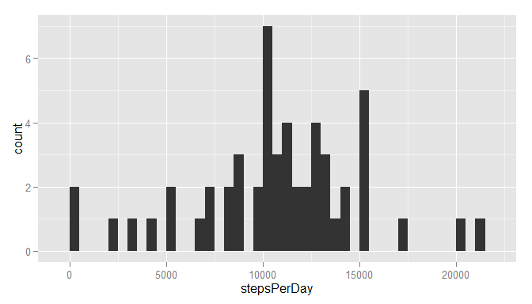
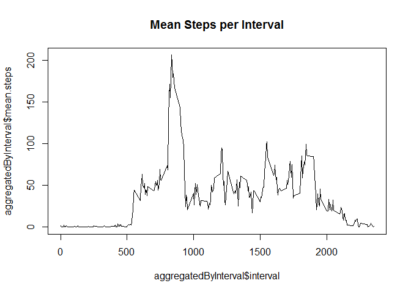
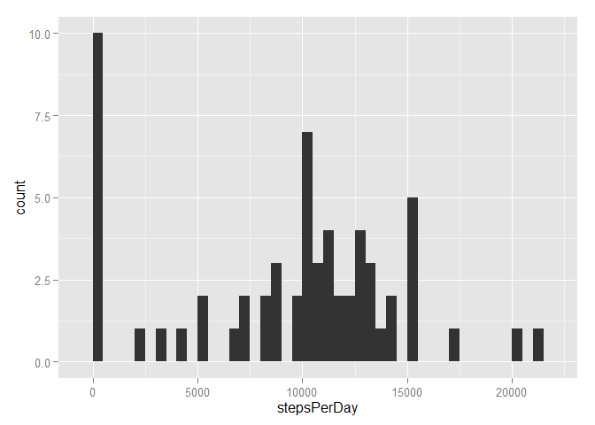
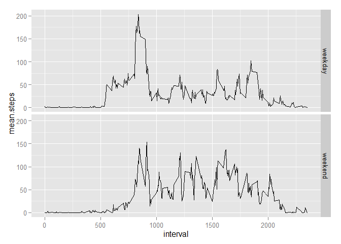

# Reproducible Research: Peer Assessment 1


## Loading and preprocessing the data
Assuming that the file "repdata-data-activity.zip" is already available in the same directory, we proceed to read the file.
Since the date is initially interpreted as factors, it is needed to convert it to Date format. 
'preprocessed' contains the raw data with the date in the correct format.

```r
unzip("repdata-data-activity.zip")
raw <- read.csv("activity.csv")
dates <- as.Date(raw$date, "%Y-%m-%d")
preprocessed <- raw
preprocessed$date <- dates
```

This is the status of the preprocessed data 

```r
str(preprocessed)
```

```
## 'data.frame':	17568 obs. of  3 variables:
##  $ steps   : int  NA NA NA NA NA NA NA NA NA NA ...
##  $ date    : Date, format: "2012-10-01" "2012-10-01" ...
##  $ interval: int  0 5 10 15 20 25 30 35 40 45 ...
```


## What is mean total number of steps taken per day?
First, it is necessary to aggregate the data by date. For this is needed to sum all the steps within a day regardless from which interval it came.


```r
aggregated <- aggregate(data = preprocessed, steps ~ date, sum)
names(aggregated) = c("date", "stepsPerDay")
```

'aggregated' contains the number of steps per day. Let's show the first 10 rows as an example

```r
aggregated[1:10,]
```

```
##          date stepsPerDay
## 1  2012-10-02         126
## 2  2012-10-03       11352
## 3  2012-10-04       12116
## 4  2012-10-05       13294
## 5  2012-10-06       15420
## 6  2012-10-07       11015
## 7  2012-10-09       12811
## 8  2012-10-10        9900
## 9  2012-10-11       10304
## 10 2012-10-12       17382
```

Let's now make an histogram

```r
library(ggplot2)
```

```
## Warning: package 'ggplot2' was built under R version 3.1.3
```

```r
qplot(stepsPerDay, data=aggregated, geom="histogram", binwidth=500)
```

 


The mean number of steps per day is 10766.19.
The median number of steps per day is 10765.


## What is the average daily activity pattern?

```r
aggregatedByInterval <- aggregate(data = preprocessed, steps ~ interval, mean, na.action=na.omit, simplify=TRUE)
names(aggregatedByInterval) = c("interval", "mean.steps")
plot(aggregatedByInterval$interval, aggregatedByInterval$mean.steps, type="l", main="Mean Steps per Interval")
```

 


The 5-minutes interval with the maximum average number of steps is 206.17.


## Imputing missing values

The total number of rows with NA values are 2304 

In order to impute the missing values, the following strategy is used: the missing value will be replaced by the mean of that 5-minute interval. The new dataset is in 'imputed' 

```r
imputed <- preprocessed;
nas <- is.na(imputed$steps)
imputed$steps[nas] <- unlist(subset(aggregatedByInterval, imputed$interval == interval, select = mean.steps))[1]
```

This is a  of the preprocessed data 

```r
str(imputed)
```

```
## 'data.frame':	17568 obs. of  3 variables:
##  $ steps   : num  1.72 1.72 1.72 1.72 1.72 ...
##  $ date    : Date, format: "2012-10-01" "2012-10-01" ...
##  $ interval: int  0 5 10 15 20 25 30 35 40 45 ...
```

Histogram of the total number of steps taken each day

```r
aggregatedImputed <- aggregate(data = imputed, steps ~ date, sum)
names(aggregatedImputed) = c("date", "stepsPerDay")

library(ggplot2)
qplot(stepsPerDay, data=aggregatedImputed, geom="histogram", binwidth=500)
```

 


The mean number of steps per day is 9419.08.
The median number of steps per day is 10395.

## Are there differences in activity patterns between weekdays and weekends?
Create a new factor variable in the dataset with two levels – “weekday” and “weekend” indicating whether a given date is a weekday or weekend day.

```r
imputed$dayType <- "weekday"
weekends <- weekdays(imputed$date) %in% c("Saturday", "Sunday")
imputed$dayType[weekends] <- "weekend"
```

Panel plot containing a time series plot (i.e. type = "l") of the 5-minute interval (x-axis) and the average number of steps taken, averaged across all weekday days or weekend days (y-axis)

```r
aggregatedByIntervalImputed <- aggregate(data = imputed, steps ~ interval + dayType, mean, simplify=TRUE)
names(aggregatedByIntervalImputed) = c("interval", "dayType", "mean.steps")
qplot(interval, mean.steps, data=aggregatedByIntervalImputed, geom="line", facets= dayType ~ .)
```

 

